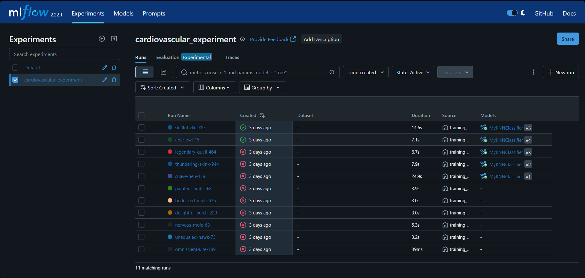
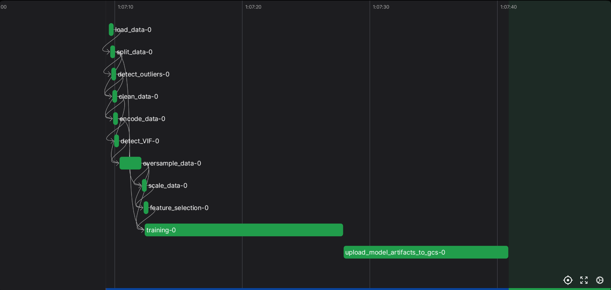
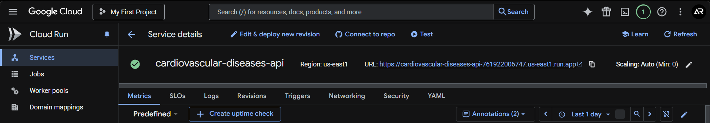
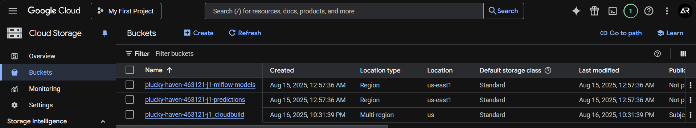
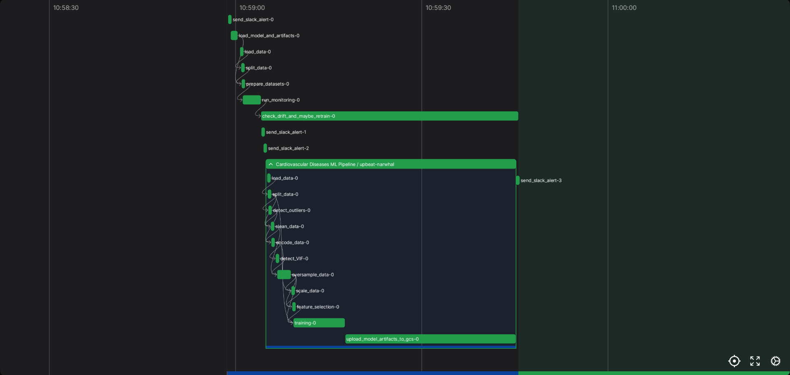
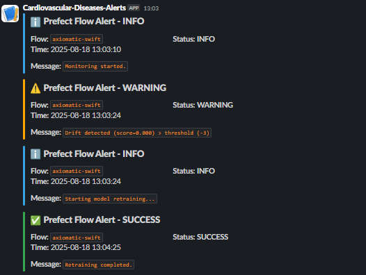
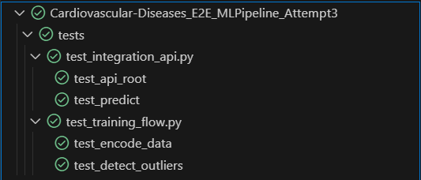
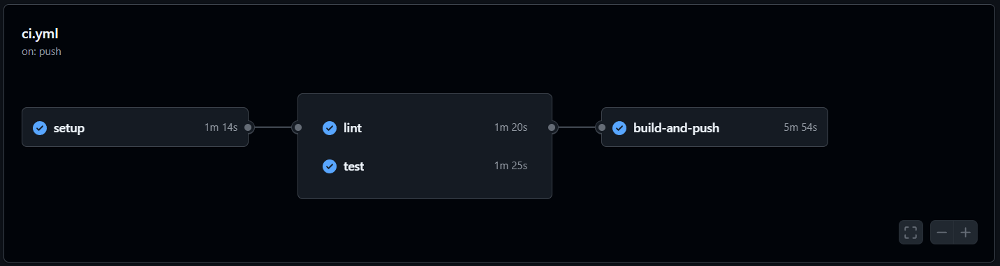

# ❤️ Cardiovascular Diseases Prediction – End-to-End ML Pipeline


## 🩺 Problem Description

Cardiovascular diseases (CVDs) are the leading cause of mortality worldwide. Early detection of risk factors (age, cholesterol, blood pressure, lifestyle, etc.) can drastically improve prevention and treatment outcomes.

This project tackles the **binary classification task** of predicting whether a patient is at risk of cardiovascular disease based on clinical and demographic features.

Beyond model development, the goal is to design a **production-ready MLOps pipeline** including training, deployment, monitoring, and infrastructure automation.

---

## 🔄 Project Background

Key components include:
- Exploratory Data Analysis (EDA) and feature engineering.
- Model training and evaluation with **MLflow tracking**.
- Automated training pipelines orchestrated with **Prefect**.
- Deployment of models via **FastAPI** and **Docker**.
- Infrastructure provisioning with **Terraform** on **Google Cloud (GCP)**.
- Monitoring of model drift and prediction quality with **Evidently AI**.
- CI/CD automation using **GitHub Actions**.

---

## 📦 Dataset

I used the [Heart Disease Dataset (UCI / Kaggle)](https://www.kaggle.com/datasets/fedesoriano/heart-failure-prediction), which contains patient records including:

- **Features**: age, sex, cholesterol, fasting blood sugar, resting ECG, maximum heart rate, exercise-induced angina, etc.
- **Target**: presence (1) or absence (0) of cardiovascular disease.

The dataset is included in the repo: [`data/heart.csv`](./data/heart.csv).

---

## 🎯 Goal

To build a **robust ML system** that:
- Trains and evaluates multiple ML models with MLflow.
- Logs metrics, artifacts, and preprocessing pipelines.
- Serves predictions via a REST API.
- Monitors drift and retrains if necessary.
- Deploys infrastructure to the cloud in a reproducible way.

---

## ⚙️ Technologies and Tools

- **MLflow** – experiment tracking & model registry
- **Prefect** – orchestration of training and inference flows
- **FastAPI** – lightweight REST API for predictions
- **Docker** – containerization
- **Terraform** – infrastructure as code (GCP)
- **Evidently AI** – monitoring & drift detection
- **GitHub Actions** – CI/CD automation
- **Pipenv** – environment management

---

## 📁 Project Structure

```bash
.
├── analysis/                     # Jupyter notebooks for EDA & modeling
│   └── cardiovascular-diseases-eda-modeling.ipynb
├── data/
│   └── heart.csv                 # Dataset
├── deployment/
│   ├── serve.py                  # Flask API for predictions
│   └── test_serve.py             # API integration test
├── infra/                        # Terraform infra configs (GCP)
│   ├── main.tf
│   ├── variables.tf
│   └── terraform.tfvars
├── models/                       # MLflow model artifacts (preprocessing + trained models)
├── monitoring/
│   ├── monitor.py                # Drift detection and reporting
│   └── full_monitor_report.html
├── output/
│   └── predictions.parquet       # Batch inference outputs
├── pipelines/
│   ├── training_flow.py          # Prefect training flow
│   ├── promote_model_flow.py     # Model promotion workflow
│   └── batch_inference.py        # Batch inference pipeline
├── scripts/
│   └── list_registered_models.py # Utility script
├── .github/workflows/ci.yml      # CI/CD with GitHub Actions
├── Makefile                      # Automation commands
├── Dockerfile                    # API containerization
├── Pipfile / Pipfile.lock        # Pipenv environment
└── README.md                     # Project documentation
```

---

## 🛠️ Makefile Usage Summary

| Command                                  | Description |
| ---------------------------------------- | ----------- |
| `make install`                           | Install dependencies with pipenv |
| `make shell`                             | Enter pipenv shell |
| `make lint`                              | Run code quality checks |
| `make test`                              | Run all tests |
| `make run-mlflow`                        | Start MLflow server (localhost:5000) |
| `make run-prefect`                       | Start Prefect server (localhost:4200) |
| `make run-training ALIAS=MyModel`        | Trigger Prefect training flow |
| `make run-inference ALIAS=MyModel`       | Run batch inference pipeline |
| `make run-monitoring ALIAS=MyModel`      | Run Evidently monitoring |
| `make run-api`                           | Run FastAPI in Docker |
| `make test-remote`                       | Test `/predict` endpoint |
| `make build-image`                       | Build Docker image locally |
| `make gcp-deploy`                        | Build & push image to GCP Container Registry |
| `make terraform-deploy`                  | Deploy infra with Terraform |
| `make terraform-destroy`                 | Destroy infra with Terraform |
| `make list-models`                       | List registered MLflow models |

---

## 📊 Model Performance (Notebook Highlights)

From the [EDA & modeling notebook](./analysis/cardiovascular-diseases-eda-modeling.ipynb):

- Benchmarked models: Logistic Regression, Decision Trees, Random Forest, KNN, Gradient Boosting.
- Best performing candidate: **KNeighborsClassifier** (based on ROC AUC and F1).
- Artifacts (preprocessing + models) are versioned under [`models/`](./models).

---

## 🧭 Project usage guide

This section walks through the usage of the project in detail, from setting up the environment to training the model, deploying the service, running monitoring, and executing tests.

---

### 🧪 1. Environment setup

Before using any functionality, ensure you have the required tools installed:

- Python ≥ 3.10
- [Pipenv](https://pipenv.pypa.io)
- [Docker](https://www.docker.com/)
- [Terraform](https://developer.hashicorp.com/terraform)
- [Google Cloud SDK](https://cloud.google.com/sdk)

Then, install dependencies:

```bash
make install
```

Activate the virtual environment:

```bash
make shell
```

Configure your `.env` file with required variables (e.g., `SLACK_WEBHOOK_URL`, GCP project ID, etc.).

---

### ⚙️ 2. Training pipeline with Prefect and MLflow

Start tracking and orchestration servers:

```bash
make run-mlflow      # Launch MLflow server on localhost:5000
```



```bash
make run-prefect     # Launch Prefect UI on localhost:4200
```



Trigger the full training pipeline:

```bash
make run-training ALIAS=CardioModel
```

The pipeline performs the following steps:

1. Load and preprocess the dataset (`data/heart.csv`).
2. Apply scaling, one-hot encoding, feature selection, and oversampling.
3. Train and evaluate multiple models (KNN, Decision Tree, Random Forest, etc.).
4. Register the model and preprocessing pipeline in MLflow.
5. Store artifacts (models, scalers, encoders) under `models/`.

Each run is logged in MLflow with metrics (ROC AUC, F1, Accuracy, etc.) and artifacts.

---

### 🚀 3. API Serving with FastAPI and Docker

Once a model is trained, serve it locally via FastAPI:

```bash
make run-api
```

This builds the Docker image, starts a container, and serves the API on `http://localhost:8080`. The API includes a `/predict` endpoint that expects a JSON payload. You can test it with:

```bash
make test-remote
```

This sends a real HTTP request to the API and prints the predicted class.

⚠️ Configuration notes

To make the API work correctly with your trained model and desired environment:

- In deployment/serve.py, make sure to set the correct RUN_ID, which corresponds to the ID of the model version you want to serve from MLflow. For example:

```python
# Remote endpoint (Cloud Run)
API_URL = "https://cardiovascular-diseases-api-761922006747.us-east1.run.app/predict"

# Local endpoint
API_URL = "http://localhost:8080/predict"
```

> Remember to uncomment the correct API_URL based on your testing setup and comment out the unused one. This ensures the request is sent to the proper location for prediction.

---

### 🧱 4. Docker build and deployment to GCP

Build the image locally:

```bash
make build-image
```

Authenticate with GCP:

```bash
gcloud auth login
gcloud config set project YOUR_PROJECT_ID
```

Push the image to GCP Container Registry:

```bash
make gcp-deploy
```



The API home is available [here](https://cardiovascular-diseases-api-761922006747.us-east1.run.app).

---

### ☁️ 5. Infrastructure provisioning with Terraform

Deploy cloud infrastructure (Cloud Run service, GCS buckets, IAM policies):

```bash
make terraform-deploy
```


Destroy infrastructure:

```bash
make terraform-destroy
```

Parameters (region, bucket names, project) are defined in `infra/terraform.tfvars`.

---

### 📊 6. Monitoring with Evidently

Run monitoring pipeline with:

```bash
make run-monitoring ALIAS=CardioModel
```



This generates:
- `monitoring/full_monitor_report.html` (detailed drift & performance report)
- Slack alert if drift threshold exceeded



If drift is detected, Prefect triggers retraining.

You can view the monitoring report [here](https://aletbm.github.io/Cardiovascular-Diseases_E2E_MLPipeline/monitoring/full_monitor_report.html).

---

### ✅ 7. Testing and code quality

Run static checks and tests:

```bash
make lint
make test
```



Tests include:
- Unit tests for training pipeline and preprocessing.
- Integration tests for the API (`test_serve.py`).

---

### 🔁 8. CI/CD Integration

The `.github/workflows/ci.yml` defines GitHub Actions workflows that run on push/PR:



- **setup**: install dependencies with pipenv
- **lint**: enforce code style (black, flake8)
- **test**: run pytest (unit + integration)
- **build-and-push**: build and push Docker image to GCP registry

Secrets (`GCP_SA_KEY`, etc.) must be configured in GitHub repo settings.

---
